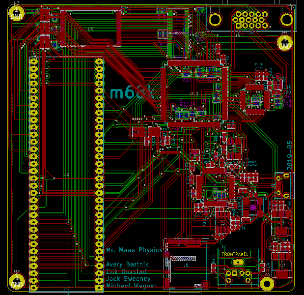
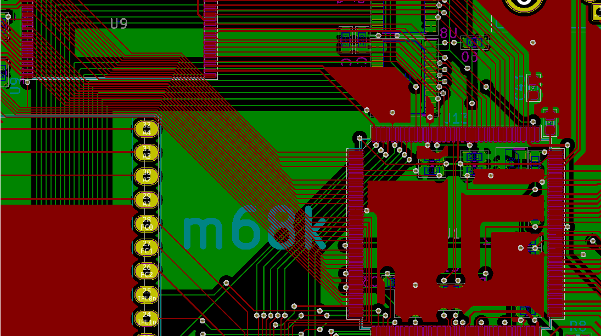
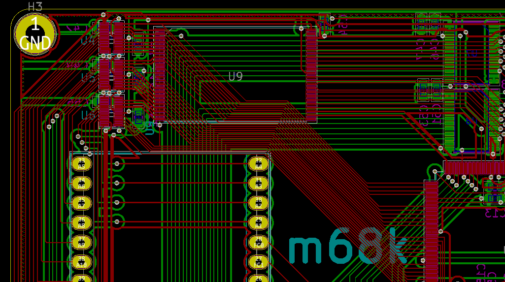
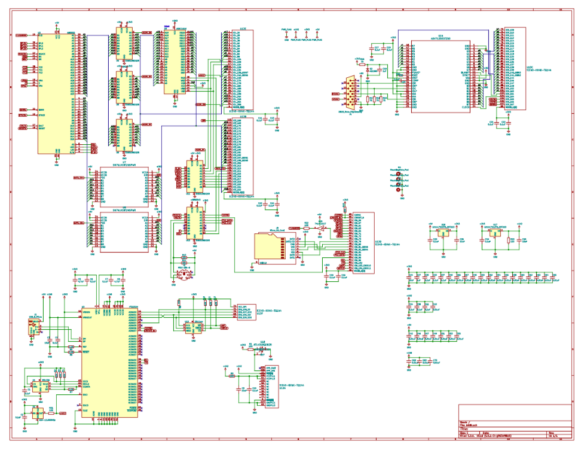

# m68k
A [Motorola 68000](https://en.wikipedia.org/wiki/Motorola_68000) computer
## Contributors
* Avery Bartnik
  * Assembly Programming
  * README
* Erik Duxstad
  * Schematic
  * PCB Layout
  * Ordering PCB
* Jack Sweeney
  * Schematic
  * Assembly Programming
  * FPGA Verilog
  * Simulation
* Michael Wagner
  * Schematic
  * PCB Layout
  * Ordering Parts
## What We Did
1. Design schematic for 68000 computer
2. Design and layout the PCB
3. Order the PCB and parts
4. Wrote Verilog HDL for the FPGA
5. Set up a RTL simulator for the whole computer design
6. Wrote an assembly program in the simulator that displays text using the serial port
## What We Will Do
1. Solder the parts to the PCB
2. Synthesize the verilog and flash to SPI Flash to configure FPGA
3. Interface with the board via the serial port
4. Run programs on real hardware!
## Long-Term Improvements
1. Enable on-board SRAM
2. Configure toolchain to allow for C programming
3. Add scheduling interrupt
4. Install Linux
5. Set up VGA peripheral
6. Set up PS/2 peripheral
7. Set up SD Card peripheral
8. Make MMU on FPGA for Linux
## Gallery
### PCB Render Front

### PCB Render Back

### PCB Render Names

### PCB Layout Editor Overview

### PCB Layout Editor FPGA

### PCB Layout Editor SRAM

### PCB Schematic

