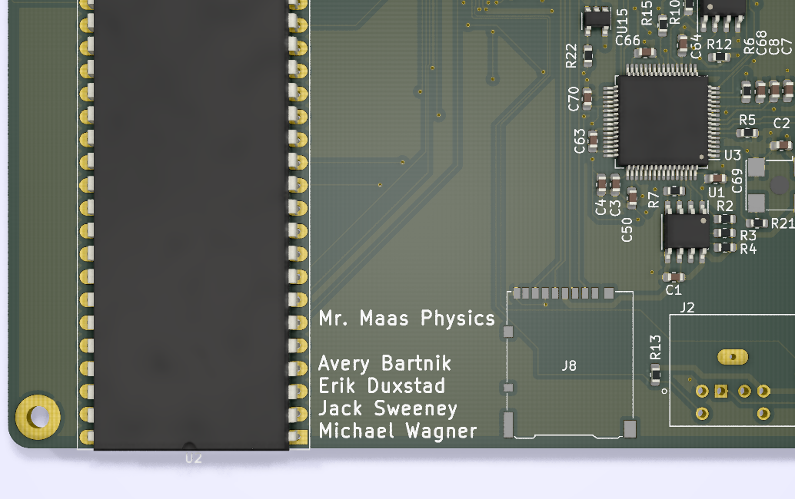

# m68k
A [Motorola 68000](https://en.wikipedia.org/wiki/Motorola_68000) computer
## Contributors
* Avery Bartnik
  * Assembly Programming
  * README
* Erik Duxstad
  * Schematic
  * PCB Layout
  * Ordering PCB
* Jack Sweeney
  * Schematic
  * Assembly Programming
  * FPGA Verilog
  * Simulation
* Michael Wagner
  * Schematic
  * PCB Layout
  * Ordering Parts
## What We Did
1. Designed and ordered PCBs on which components to build the computer could be placed
2. Set up a RTL simulator for the Motorola 68000 processor
3. Wrote an assembly program in the simulator that displays text using a serial port
## What We Will Do
1. Solder the parts to the PCB
2. Synthesize the verilog and flash to SPI Flash to configure FPGA
3. Interface with the board via the serial port
## Long-Term Improvements
1. Enable on-board SRAM
2. Configure toolchain to allow for C programming
3. Add scheduling interrupt
4. Install Linux
5. Set up VGA peripheral
6. Set up PS/2 peripheral
7. Set up SD Card peripheral
8. Make MMU on FPGA for Linux
## Gallery
### PCB Render Front

### PCB Render Back

### PCB Render Names

### PCB Layout Editor Overview

### PCB Layout Editor FPGA

### PCB Layout Editor SRAM

